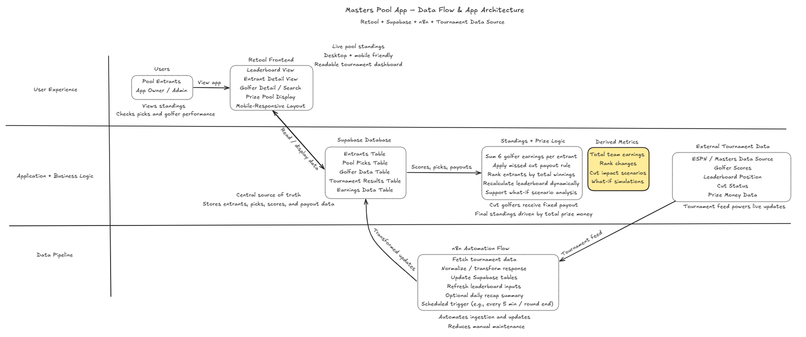
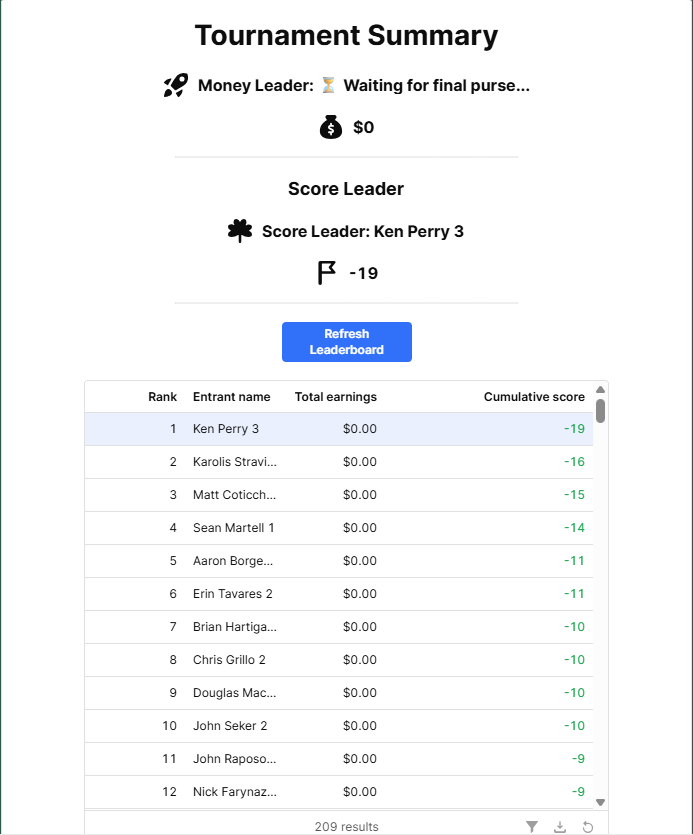
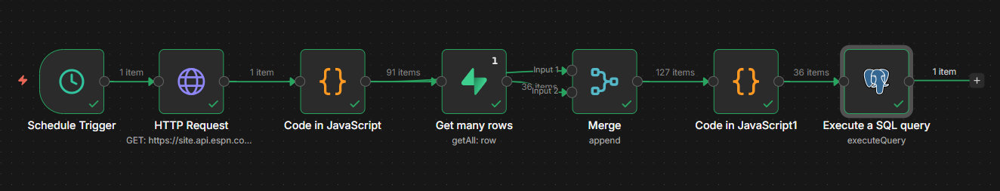

# Masters Pool App: Real-Time Tournament Data & Leaderboard Engine

A real-time tournament pool application built with **Retool**, **Supabase**, and **n8n** that automates leaderboard tracking, calculates standings dynamically, and transforms live tournament data into a fully interactive experience.

---

## Overview

Tournament pools are typically managed manually:

- Scores are tracked across multiple sources  
- Prize calculations are done in spreadsheets  
- Leaderboards are updated inconsistently  
- Participants lack real-time visibility  

This project demonstrates how to build a **fully automated, real-time leaderboard system** that:

- Ingests live tournament data  
- Stores structured player and entrant relationships  
- Calculates standings dynamically  
- Displays results in a clean, mobile-friendly UI  

The result is a system that transforms a **manual, spreadsheet-based process → automated, real-time application**.

---

## Architecture

This system is built using a **layered architecture**:

1. **User Experience (Retool Frontend)**
2. **Data Storage (Supabase)**
3. **Business Logic (Standings + Prize Calculations)**
4. **Automation Layer (n8n Data Pipeline)**
5. **External Data Source (Tournament Feed)**

---

## Problem

Managing a tournament pool manually introduces several challenges:

- Leaderboards require constant manual updates  
- Prize calculations are error-prone  
- Data is fragmented across tools  
- No real-time visibility for participants  
- No ability to simulate outcomes or analyze scenarios  

---

## Solution

This system introduces an **automated leaderboard engine** that:

- Centralizes all pool data in a structured database  
- Automates tournament data ingestion  
- Applies consistent business logic for scoring and payouts  
- Dynamically calculates standings  
- Provides a real-time, user-friendly interface  

---

## What This App Does

- Stores entrants and their selected golfers  
- Ingests tournament data from an external source  
- Tracks golfer performance and earnings  
- Calculates total team earnings per entrant  
- Applies tournament-specific rules (e.g., missed cut payouts)  
- Ranks entrants dynamically based on performance  
- Displays results in a live leaderboard  

---

## How It Works

### 1. Data Ingestion (n8n)

- Pulls tournament data from an external source (e.g., ESPN)  
- Normalizes and transforms the data  
- Updates Supabase tables  
- Runs on a scheduled trigger (e.g., every 5 minutes or at round completion)  

---

### 2. Data Storage (Supabase)

Supabase acts as the **central source of truth**, storing:

- Entrants  
- Pool picks  
- Golfer data  
- Tournament results  
- Earnings data  

---

### 3. Business Logic (Standings Engine)

The system calculates standings by:

- Summing earnings across each entrant’s selected golfers  
- Applying rules such as fixed payouts for missed cuts  
- Recalculating rankings dynamically as new data is ingested  
- Supporting scenario-based analysis (what-if outcomes)  

---

### 4. Derived Metrics Layer

Beyond raw calculations, the system generates:

- Total team earnings  
- Rank changes  
- Cut impact scenarios  
- What-if simulations  

This transforms the app from a simple tracker into an **insight-driven tool**.

---

### 5. Frontend Experience (Retool)

The Retool app provides:

- Live leaderboard view  
- Entrant-level breakdowns  
- Golfer performance details  
- Prize pool visualization  
- Mobile-friendly experience  

---

## Data Model

### Entrants
- entrant_id  
- name  

### Pool Picks
- entrant_id  
- golfer_id  

### Golfers
- golfer_id  
- name  

### Earnings
- golfer_id  
- earnings  

---

## Example Outputs

### App Interface

---

### Architecture Flow

---

## Files Included

### Data Files
- `entrant_NEW.csv`  
- `golfer_name.csv`  
- `pool_picks_2026_NEW.csv`  
- `Masters 2026 Final Teams.xlsx`  

### Architecture & Design
- `architecture_flow.png`  
- `process_flow.png`  
- `sample_app_screenshot.png`  

### Automation
- `masters_pool_app.json` (n8n workflow export)

---

## Key Outcomes

- Eliminates manual leaderboard tracking  
- Enables real-time visibility into standings  
- Standardizes scoring and payout calculations  
- Reduces risk of human error  
- Provides a scalable framework for event-based applications  

---

## Why This Matters

Most event-based systems rely on manual processes and fragmented tools.

This project demonstrates how to:

> **Transform live event data into a structured, automated, and user-friendly system.**

---

## Tech Stack

- **Retool** (frontend UI)  
- **Supabase** (database + backend)  
- **n8n** (workflow automation)  
- **External API** (tournament data source)  

---

## Author

Built by Jesse Snow  
Focused on **Automation, Data Systems, and Scalable Application Design**

---
